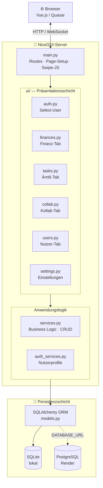
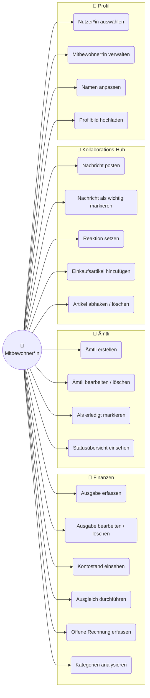
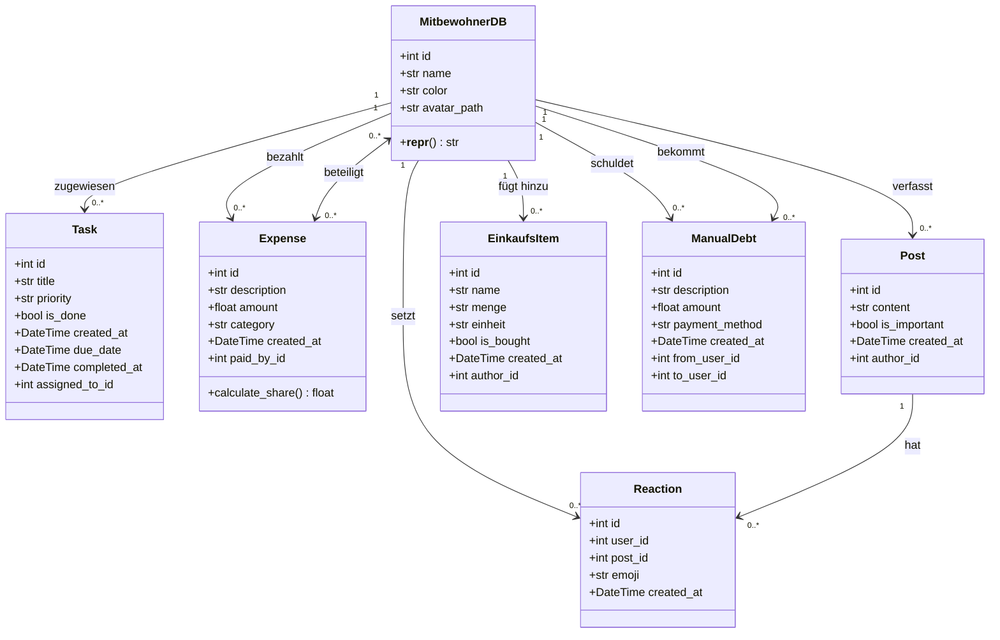
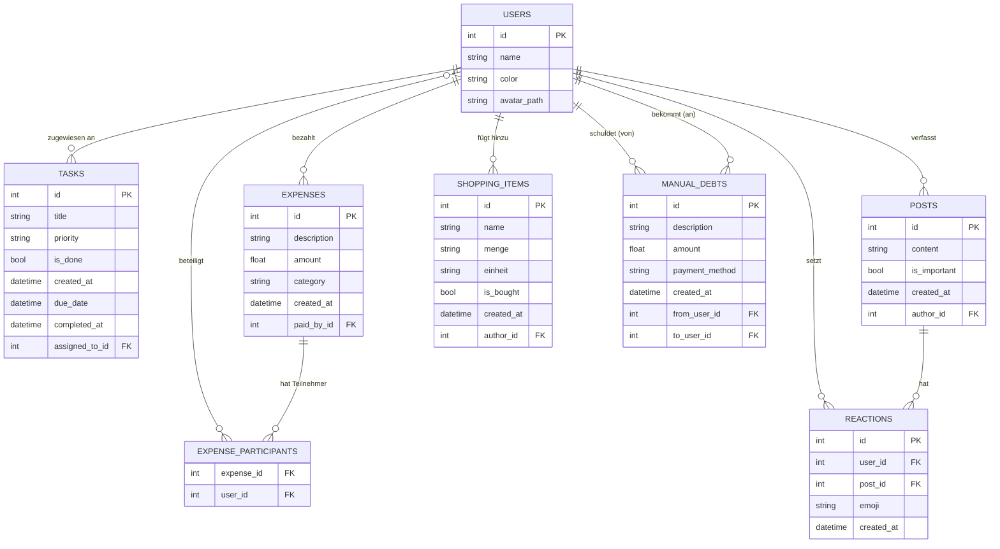
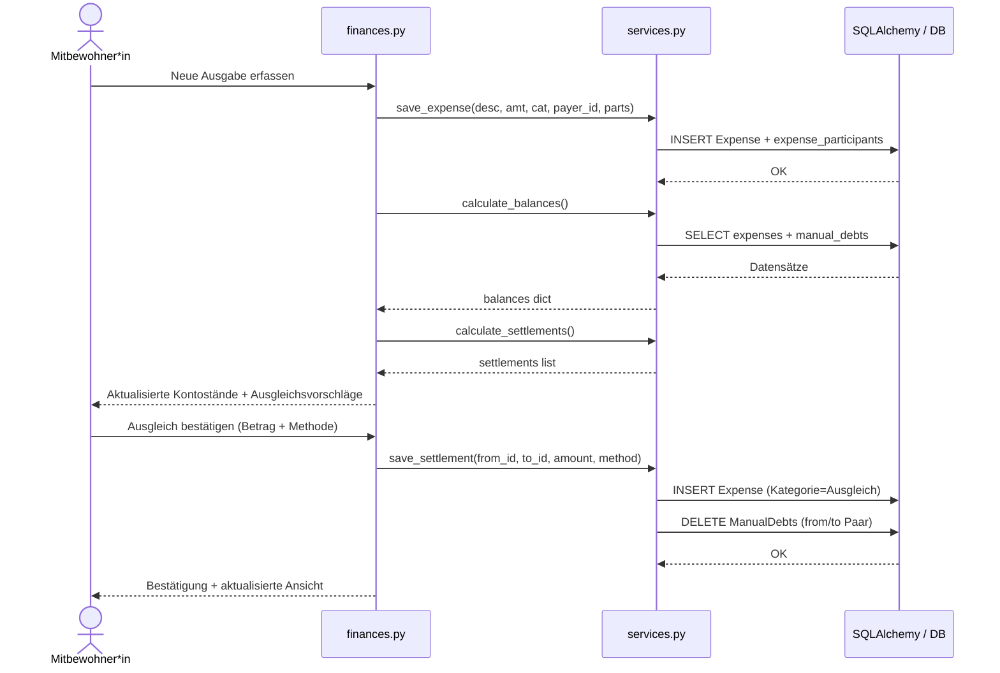

# WG‑Planner: Finances & Task Management

## 1. Projektbeschreibung
Dieses Repository enthält den Code für den **WG‑Planner**, eine browserbasierte Anwendung zur koordinativen Unterstützung von Wohngemeinschaften. Entwickelt im Rahmen des Moduls "Objektorientierte Programmierung" (26FS) an der FHNW, verwaltet die Anwendung gemeinsame Ausgaben, Haushaltsaufgaben, Kommunikation und Einkaufslisten.

---

## 2. Implementierte Kernfunktionen

### 👥 Mitbewohner\*innen-Verwaltung
- Hinzufügen, Bearbeiten und Löschen von Mitbewohner*innen
- Farbkodierte Initialen-Avatare (automatische Farbzuweisung aus Palette)
- Header-Avatar mit Dropdown-Menü (Einstellungen / Nutzer wechseln)

### 💸 Shared-Expense-Tracker
- Erfassung gemeinsamer Ausgaben (Beschreibung, Betrag, Kategorie, Zahler, Beteiligte)
- **Bearbeiten** bestehender Ausgaben per Edit-Dialog
- Automatische Anteilsberechnung (gleichmässige Aufteilung auf Beteiligte)
- Echtzeit-Kontostände (Guthaben vs. Schulden) pro Mitbewohner*in
- Optimierte Ausgleichsvorschläge zur Minimierung der Überweisungen
- Ausgleich wählt Zahlungsmethode (Twint / Bargeld / Banküberweisung) und wird als eigene Ausgabe mit Kategorie „Ausgleich" im Transaktionsverlauf gespeichert
- Manuell erfassbare offene Rechnungen (werden pro Paar gruppiert angezeigt)
- Kategorisierung inkl. Custom-Kategorien mit Balken-Visualisierung nach Anteil
- Vollständiger Transaktionsverlauf (reguläre Ausgaben und Ausgleichszahlungen visuell unterschieden)
- **Echtzeit-Sync zwischen Clients**: 1-Sekunden-Polling via gemeinsamem Versions-Zähler in `app.storage.general`

### 🧹 Ämtli-Plan
- Verwaltung von Haushaltsaufgaben mit Deadline-Tracking und farbkodierter Statusansicht:
  - **Abgelaufen** (rot): Deadline bereits überschritten
  - **Bald fällig** (orange): Deadline innerhalb der nächsten 24 Stunden
  - **Zu erledigen** (gelb): Offene Aufgaben mit zukünftiger Deadline
  - **Erledigt** (grün): Abgehakte Aufgaben mit Erledigungsdatum
- Deadline-Badge (Wochentag + Datum) direkt auf jeder Aufgabenkarte
- Ämtli bearbeiten und löschen

### 💬 Kollaborations-Hub
- **WG-Blog** (Schwarzes Brett):
  - Nachrichten verfassen und löschen
  - Nachrichten als **„Wichtig"** markieren (roter „WICHTIG"-Badge + rote Hervorhebung)
  - Reaktions-Emojis (👍 ❤️ 😂 😮 😢) mit Anzeige der reagierenden Personen per Tooltip
  - Auto-Refresh alle **5 Sekunden**
- **Einkaufsliste**:
  - Artikel mit optionaler **Menge + Einheit** erfassen (z.B. „Milch · 2 Liter")
  - Artikel abhaken (erledigt / offen getrennt dargestellt)
  - **Alle erledigten Artikel mit einem Klick löschen**
  - Auto-Sync alle **2 Sekunden**

### 👤 Nutzerprofile
- Mitbewohner*in per Dropdown auswählen (Startseite `/select-user`)
- Name im Einstellungs-Bereich anpassen
- Profilbild hochladen (JPG/PNG, max. 2 MB)

### 📱 UI & Responsivität
- **Swipe-Gesten** für Tab-Navigation (Touch & Maus-Drag mit Rubber-Band-Effekt an den Rändern)
- **Responsives Grid-Layout**: 3-spaltig → 2-spaltig (≤ 1200 px) → 1-spaltig (≤ 800 px)
- Alle Haupt-Tabs (Mitbewohner, Finanzen, Ämtli) **Auto-Refresh alle 10 Sekunden**

---

## 3. Technische Architektur

Die Lösung ist als klassische **Drei-Schichten-Architektur** implementiert:

| Schicht | Technologie | Verantwortung |
|---|---|---|
| **Präsentation** | Browser (Vue.js/Quasar via NiceGUI) | Thin Client, rendert UI-Komponenten |
| **Anwendungslogik** | Python / NiceGUI (server-seitig) | UI-Zustand, Geschäftslogik, OOP-Klassen |
| **Persistenz** | SQLAlchemy ORM + SQLite / PostgreSQL | Datenhaltung ohne direktes SQL |

### Schichttrennung

- **`models.py`** – ORM-Datenmodelle (`MitbewohnerDB`, `Task`, `Expense`, `Post` etc.) und DB-Initialisierung
- **`services.py`** – Reine Anwendungslogik; keinerlei NiceGUI-Abhängigkeiten, akzeptiert plain Python-Werte
- **`auth_services.py`** – Nutzerprofile (Avatar, Profilabfrage); ebenfalls UI-frei
- **`ui/`** – Alle NiceGUI-Komponenten; zuständig für Darstellung, Validierungsmeldungen (`ui.notify`) und User-Feedback

Session-Management erfolgt durchgängig mit SQLAlchemy Context Managern (`with Session() as session:`). Schema-Migrationen werden via `sqlalchemy.inspect` abgesichert, sodass Spalten nur hinzugefügt werden, wenn sie fehlen.

### Architektur-Diagramm



---

## 4. Modellierung

### 4.1 Use-Case-Diagramm



---

### 4.2 UML-Klassendiagramm



---

### 4.3 ER-Diagramm



---

### 4.4 Sequenzdiagramm – Ausgleich durchführen



---

## 5. User Stories

**Finanzen**
- Als Mitbewohner\*in möchte ich gemeinsame Ausgaben erfassen, damit der Überblick erhalten bleibt.
- Als Mitbewohner\*in möchte ich Ausgaben nachträglich bearbeiten können, falls sich etwas geändert hat.
- Als Mitbewohner\*in möchte ich den Schuldenstand sehen, um den Ausgleich zu planen.
- Als Nutzer\*in möchte ich Ausgaben Kategorien zuordnen, um Kostenstellen zu analysieren.
- Als Mitbewohner\*in möchte ich einen Ausgleich via Twint, Bargeld oder Überweisung bestätigen.

**Ämtli & Organisation**
- Als Mitbewohner\*in möchte ich ein Ämtli als "erledigt" markieren, damit andere den Status sehen.
- Als Mitbewohner\*in möchte ich Aufgaben mit Deadlines versehen, damit nichts vergessen geht.
- Als Mitbewohner\*in möchte ich abgelaufene Aufgaben sofort erkennen, damit ich sie priorisieren kann.
- Als Mitbewohner\*in möchte ich sehen, welche Aufgaben in den nächsten 24 Stunden fällig sind.
- Als Mitbewohner\*in möchte ich das Erledigungsdatum einer Aufgabe sehen, um den Fortschritt nachzuverfolgen.

**Kommunikation**
- Als Mitbewohner\*in möchte ich Nachrichten im WG-Blog posten, um alle zu informieren.
- Als Mitbewohner\*in möchte ich eine Nachricht als „Wichtig" markieren, damit sie auffällt.
- Als Mitbewohner\*in möchte ich eine gemeinsame Einkaufsliste führen, die sich live aktualisiert.
- Als Mitbewohner\*in möchte ich Einkaufsartikel mit Menge und Einheit erfassen.
- Als Mitbewohner\*in möchte ich erledigte Einkaufsartikel gesammelt löschen können.

**Profil**
- Als Mitbewohner\*in möchte ich meinen Namen im Einstellungs-Bereich anpassen können.
- Als Mitbewohner\*in möchte ich ein Profilbild hochladen können.

---

## 6. Installation & Ausführung

1. Repository klonen:
   ```bash
   git clone https://github.com/kerlcarl/WG_Planner_Project.git
   cd WG_Planner_Project
   ```
2. Virtuelle Umgebung erstellen und aktivieren:
   ```bash
   python3 -m venv .venv
   source .venv/bin/activate   # Windows: .venv\Scripts\activate
   ```
3. Abhängigkeiten installieren:
   ```bash
   pip install -r requirements.txt
   ```
4. Anwendung starten:
   ```bash
   python3 main.py
   ```
5. Im Browser öffnen: `http://localhost:8080`

### Umgebungsvariablen (optional)

| Variable | Standard | Beschreibung |
|---|---|---|
| `PORT` | `8080` | HTTP-Port |
| `DATABASE_URL` | `sqlite:///wg_planner.db` | DB-Verbindung (SQLite oder PostgreSQL) |
| `STORAGE_SECRET` | *(dev-Wert)* | Secret für NiceGUI Session-Storage |

---

## 7. Verwendete Bibliotheken

| Bibliothek | Version | Zweck |
|---|---|---|
| **NiceGUI** | ≥ 1.0 | Server-seitiges UI-Framework (Vue.js/Quasar) |
| **SQLAlchemy** | ≥ 1.4 | ORM & Datenbankabstraktion |
| **Pydantic** | (via NiceGUI) | Datenvalidierung (FastAPI-Integration) |
| **FastAPI** | (via NiceGUI) | HTTP-Endpunkte |
| **psycopg2-binary** | ≥ 2.9 | PostgreSQL-Treiber (nur für Render-Deployment) |
| **SQLite** / **PostgreSQL** | – | Persistenzschicht |

---

## 8. Deployment (Render)

Die Datei `render.yaml` enthält die Konfiguration für ein Deployment auf [Render](https://render.com). Dabei wird automatisch `DATABASE_URL` auf eine PostgreSQL-Instanz gesetzt – die Anwendung erkennt dies und wechselt vom SQLite-Modus.
